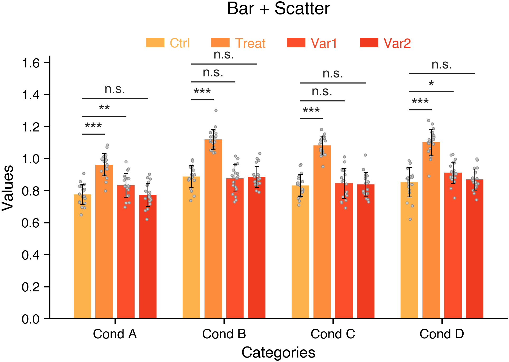
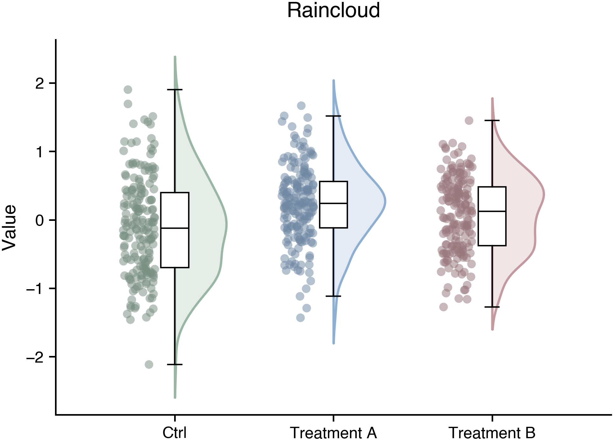
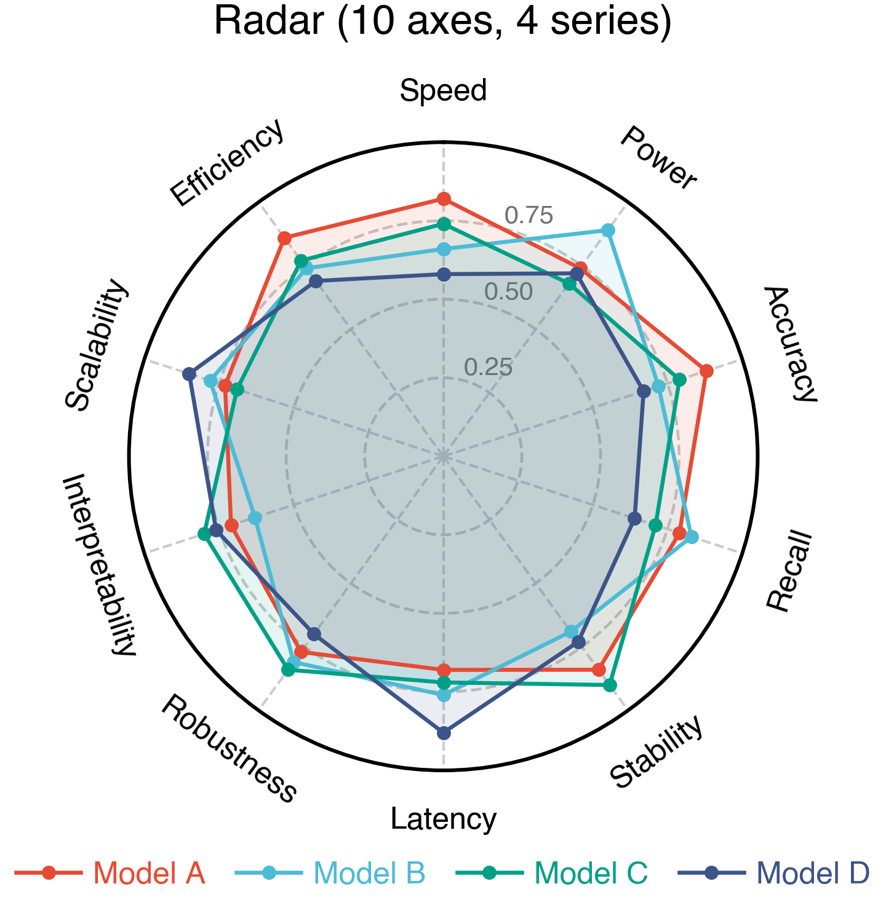
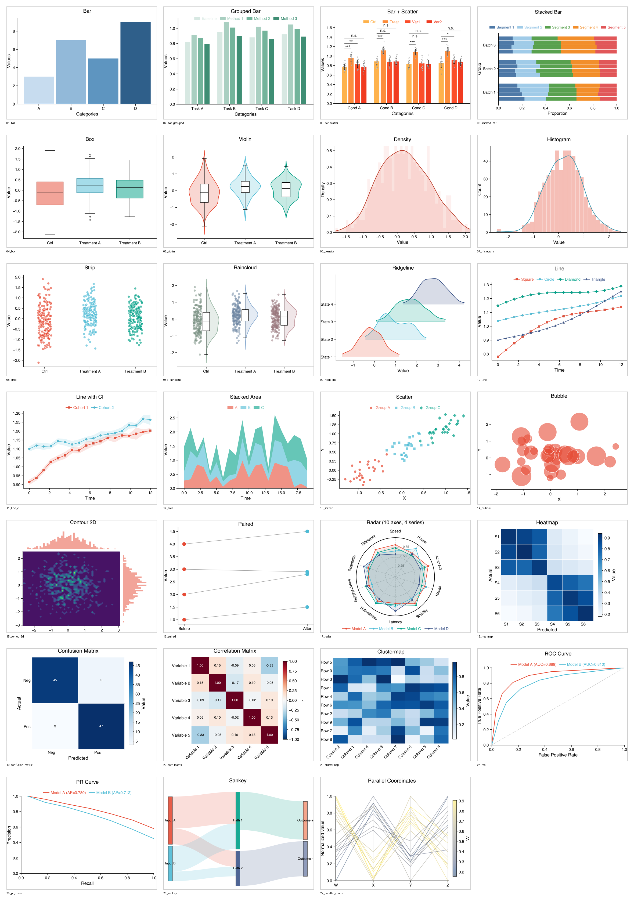

# pubfig

<div align="center">

  

  <p>
    
    
    
    <a href="https://github.com/Galaxy-Dawn/pubfig"></a>
  </p>

  <strong>Language</strong>: <a href="https://github.com/Galaxy-Dawn/pubfig/blob/main/README.md">English</a> | <a href="https://github.com/Galaxy-Dawn/pubfig/blob/main/README.zh-CN.md">中文</a>

</div>

> 用 Matplotlib 生成出版级科研图件，并提供期刊风格主题与投稿导向导出工作流。

## 亮点

- **论文导向默认值** — 更紧凑的标题、更干净的图例、显式字体处理，以及更接近论文风格的线宽。
- **常见图形集中在一个库里** — 统计图、分布图、降维图、评估曲线、热图与 flow 图都在同一个 API 表面之下。
- **面向投稿的导出接口** — `save_figure(...)` 支持 `single`/`double` 栏宽、vector 格式、raster DPI 和 trim。
- **Matplotlib 原生工作流** — 所有绘图函数都返回 Matplotlib `Figure` 对象，便于接入现有分析脚本。
- **显式布局控制** — 可精细控制刻度朝向、box/grid 显示、palette、legend 与各图专属布局参数。

## Recent News

2026-03-20: 与 pubtab 风格对齐并刷新首页结构 — 按照 pubtab 的首页组织方式重排 README，补上居中 badges、语言切换、highlights、带日期的 recent news、精选示例和 gallery hero 图。
2026-03-20: 默认完整安装与元信息简化 — 将 `pip install pubfig` 调整为默认安装完整绘图栈，移除主安装路径上的用户可见 extras，并同步统一包元信息、GitHub About 和 README 文案。
2026-03-19: 新增 raincloud 并刷新 gallery — 增加 `raincloud(...)`，优化其默认样式，接入 gallery，并重新导出整套图像产物。
2026-03-19: 更新 PCA biplot 与 radar 默认示例 — 扩展 `pca_biplot(...)` 的 loading panel 模式和 group ellipses，刷新 radar 默认示例，统一字体处理，并重新导出 gallery。

## 示例

### 精选展示

<p align="center">
  <a href="examples/bar_scatter.png"></a>
  <a href="examples/raincloud.png"></a>
</p>
<p align="center">
  <a href="examples/radar.png"></a>
</p>

<details>
<summary><strong>完整图库</strong></summary>

<p align="center">
  
</p>

</details>

## 快速开始

```bash
pip install pubfig
```

### Python 快速上手

```python
import numpy as np
import pubfig as pf

pf.set_default_theme("nature")

rng = np.random.default_rng(0)
data = rng.normal(loc=0.0, scale=1.0, size=(3, 2, 20))

fig = pf.bar_scatter(
    data,
    category_names=["Condition A", "Condition B", "Condition C"],
    series_names=["Ctrl", "Treatment"],
    title="Bar + Scatter",
)

pf.save_figure(
    fig,
    "figure1",
    spec="nature",
    width="single",
    aspect_ratio=0.65,
    raster_dpi=600,
    vector_formats=("pdf", "svg"),
    raster_formats=("png", "tiff"),
    trim=True,
)
```

如果你想使用显式后缀驱动的导出，而不是期刊导向的包装接口，可以用：

```python
pf.batch_export(fig, "figure1", formats=("pdf", "png"), dpi=300)
```

## 图类型分组

### 类别与统计图

| 函数 | 说明 |
|------|------|
| `bar` | 简单柱状图与分组柱状图 |
| `bar_scatter` | 带原始点和显著性标注的分组柱状图 |
| `stacked_bar` | 横向 stacked bar |
| `paired` | 配对点图 |

### 分布图

| 函数 | 说明 |
|------|------|
| `box` | 箱线图 |
| `violin` | 小提琴图 |
| `strip` | 条带散点图 |
| `raincloud` | half-violin + box + raw-point 的云雨图 |
| `density` | 带 KDE 的密度图 |
| `histogram` | 可选 KDE 的直方图 |
| `ridgeline` | Ridgeline 图 |

### 趋势与关系图

| 函数 | 说明 |
|------|------|
| `line` | 可带 CI 的折线图 |
| `area` | 堆叠面积图 |
| `scatter` | 支持分组工作流的散点图 |
| `bubble` | 气泡图 |
| `contour2d` | 带边缘分布的 2D contour 图 |
| `radar` | 雷达图 |

### 矩阵、嵌入与多变量图

| 函数 | 说明 |
|------|------|
| `heatmap` | 热图 |
| `corr_matrix` | 相关性热图 |
| `clustermap` | 聚类热图 |
| `dimreduce` | 降维散点图 |
| `pca_biplot` | 支持 loadings 与 group ellipses 的 PCA biplot |
| `parallel_coordinates` | 平行坐标图 |

### 评估与 Flow 图

| 函数 | 说明 |
|------|------|
| `roc` | 带 AUC 的 ROC 曲线 |
| `pr_curve` | 带 AP 的 Precision-Recall 曲线 |
| `sankey` | Sankey 图 |

## 主题、规格与配色

### 内置主题

`pubfig` 当前内置这些主题：

- `default`
- `nature`
- `science`
- `cell`

```python
pf.set_default_theme("science")
```

### Figure Specs

在导出时，`save_figure(...)` 支持这些命名规格：

- `nature`
- `science`
- `cell`

宽度支持以下写法：

- `"single"`
- `"double"`
- 数值毫米，例如 `120`
- 字符串毫米，例如 `"120mm"`

### 内置调色板

内置调色板包括：

- `DEFAULT`
- `NATURE`
- `SCIENCE`
- `LANCET`
- `JAMA`

```python
from pubfig import NATURE, show_palette

show_palette(NATURE).show()
```

你也可以按名称获取 palette：

```python
palette = pf.get_palette("science")
```

## Gallery 与示例

示例入口包括：

- `examples/gallery.py` —— 快速浏览支持的图类型
- `examples/export_gallery.py` —— 把 gallery 导出到 `output_figures/`
- `examples/export_gallery_mpl.py` —— 更聚焦的 Matplotlib 导出示例

## 开发

### 可编辑安装

```bash
pip install -e .[dev]
```

### 运行测试

```bash
pytest
```

### Lint

```bash
ruff check src tests examples
```

### 重导 Gallery

```bash
python examples/export_gallery.py
```

## 许可证

MIT
