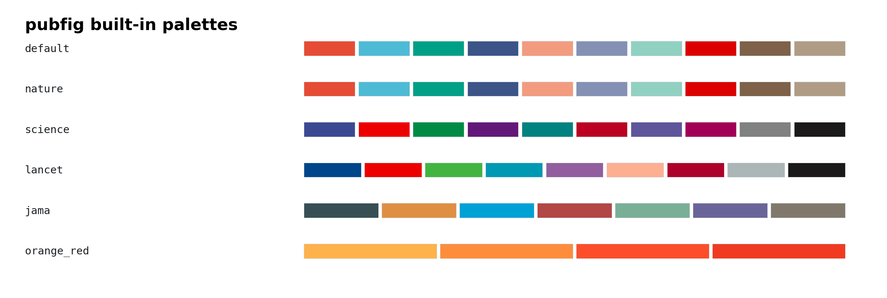
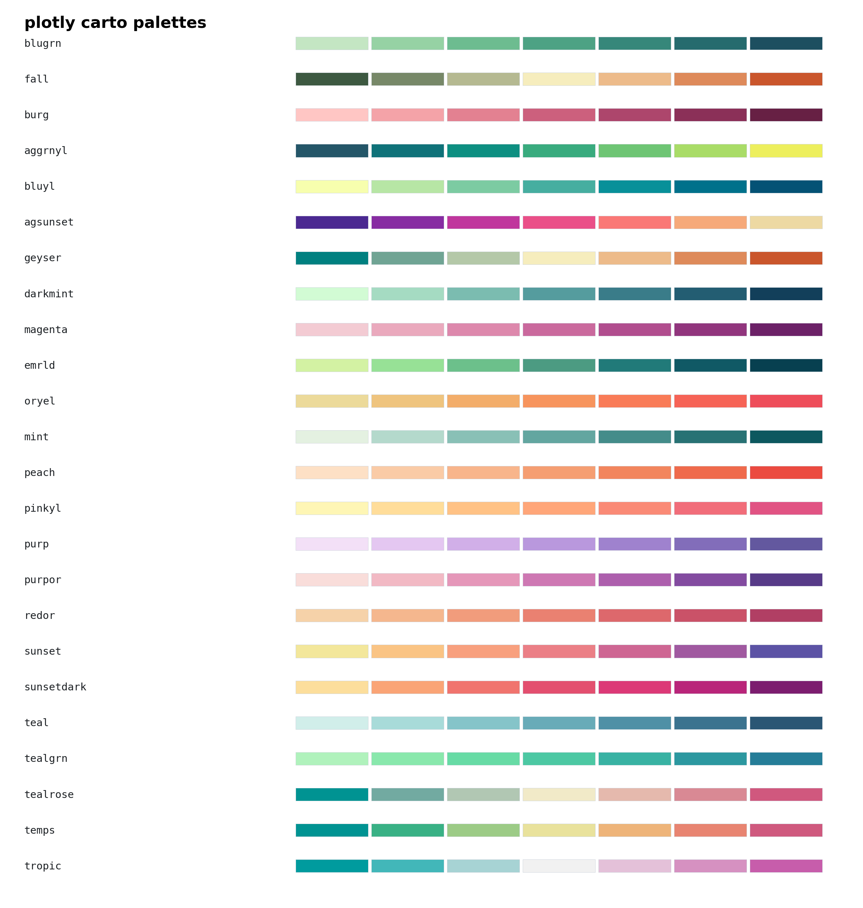
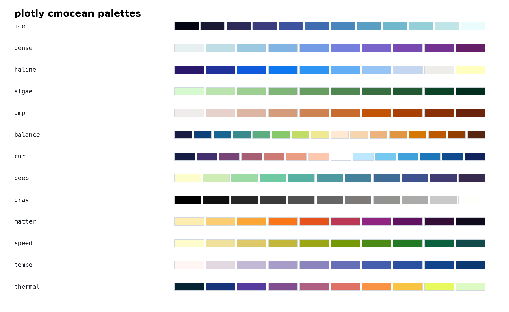
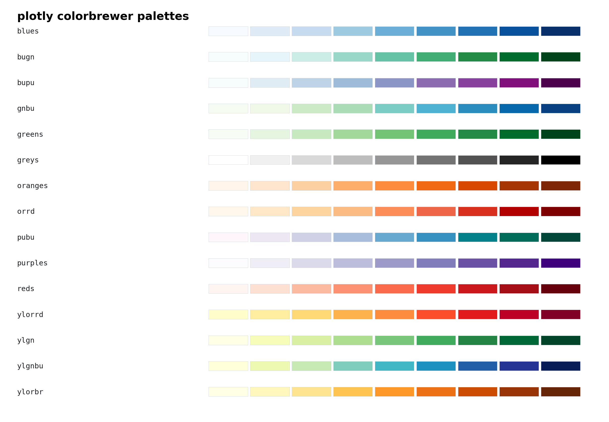

# Palette Gallery

This page previews the palettes currently available in `pubfig`.

> Source note: the `NATURE`, `SCIENCE`, `LANCET`, and `JAMA` palettes in `pubfig` are **journal-inspired** palettes derived from the ggsci community palette set. They are not official publisher-mandated color standards. References: [pal_npg](https://nanx.me/ggsci/reference/pal_npg.html), [pal_aaas](https://nanx.me/ggsci/reference/pal_aaas.html), [pal_lancet](https://nanx.me/ggsci/reference/pal_lancet.html), [pal_jama](https://nanx.me/ggsci/reference/pal_jama.html).

## Built-in Palettes

Names: `default`, `nature`, `science`, `lancet`, `jama`, `orange_red`



## Plotly Carto Palettes

Names: `carto_blugrn`, `carto_fall`, `carto_burg`, `carto_aggrnyl`, `carto_bluyl`, `carto_agsunset`, `carto_geyser`, `carto_darkmint`, `carto_magenta`, `carto_emrld`, `carto_oryel`, `carto_mint`, `carto_peach`, `carto_pinkyl`, `carto_purp`, `carto_purpor`, `carto_redor`, `carto_sunset`, `carto_sunsetdark`, `carto_teal`, `carto_tealgrn`, `carto_tealrose`, `carto_temps`, `carto_tropic`



## Plotly CMOcean Palettes

Names: `cmocean_ice`, `cmocean_dense`, `cmocean_haline`, `cmocean_algae`, `cmocean_amp`, `cmocean_balance`, `cmocean_curl`, `cmocean_deep`, `cmocean_gray`, `cmocean_matter`, `cmocean_speed`, `cmocean_tempo`, `cmocean_thermal`



## Plotly ColorBrewer Palettes

Names: `colorbrewer_blues`, `colorbrewer_bugn`, `colorbrewer_bupu`, `colorbrewer_gnbu`, `colorbrewer_greens`, `colorbrewer_greys`, `colorbrewer_oranges`, `colorbrewer_orrd`, `colorbrewer_pubu`, `colorbrewer_purples`, `colorbrewer_reds`, `colorbrewer_ylorrd`, `colorbrewer_ylgn`, `colorbrewer_ylgnbu`, `colorbrewer_ylorbr`



## Usage

```python
import pubfig as pf

palette = pf.get_palette("carto_blugrn")
```
